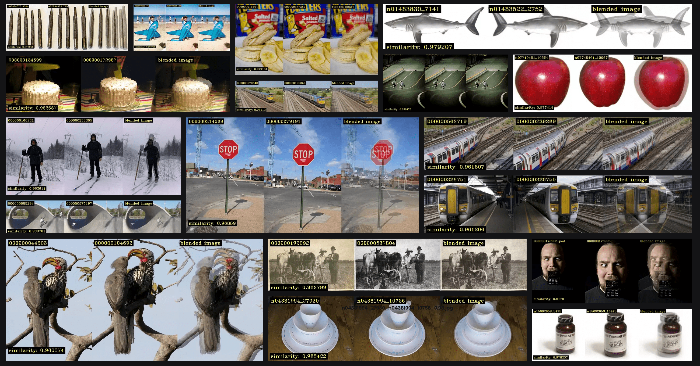
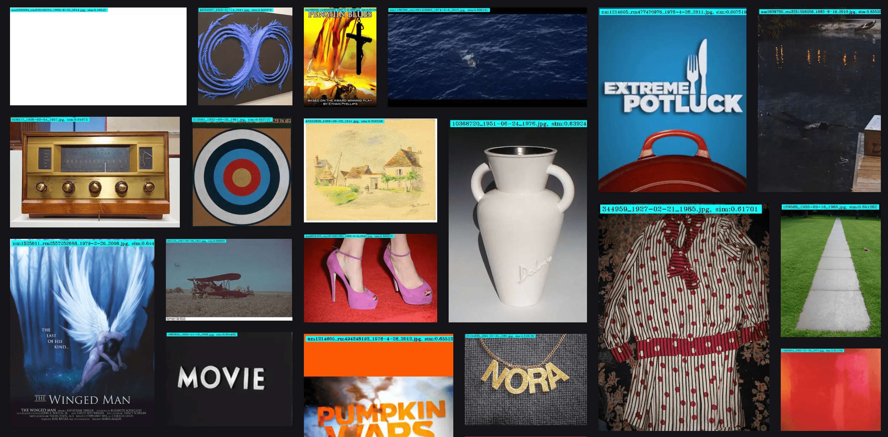

<div>
   
   <a href="https://pepy.tech/project/fastdup"></a>
   <a href="https://colab.research.google.com/github/visualdatabase/fastdup/blob/main/examples/fastdup.ipynb"></a>
   <a href="https://www.kaggle.com/graphlab/fastdup" rel="nofollow"></a>
  <a href="https://mybinder.org/v2/gh/visualdatabase/fastdup/main?labpath=exmples%2Ffastdup.ipynb" rel="nofollow"></a>
<a href="https://join.slack.com/t/visualdatabase/shared_invite/zt-19jaydbjn-lNDEDkgvSI1QwbTXSY6dlA" rel="nofollow"></a>
<a href="https://medium.com/@amiralush/large-image-datasets-today-are-a-mess-e3ea4c9e8d22" rel="nofollow"></a>
<a href="https://share-eu1.hsforms.com/1POrgIy-hTSyMaOTQzgjqhgfglt8" rel="nofollow"></a>
</div>

<div align="center" style="display:flex;flex-direction:column;">
  <a href="https://lineapy.org/">
    
  </a>
  <h1>Easily Manage, Clean & Curate Visual Data  at Scale</h1>
</div>


fastdup | Easily Manage, Clean & Curate Visual Data (images/videos) at Scale 
===================================================================
> Large Image Datasets Today are a Mess | <a href="https://bit.ly/3NJLxEe">Blog Post</a> | <a href="https://www.youtube.com/watch?v=s6qamoFzyis&t=2s">Processing LAION400m Video </a><br>

FastDup is a tool for gaining insights from a large image collection. It can find anomalies, duplicate and near duplicate images, clusters of similarity, learn the normal behavior and temporal interactions between images. It can be used for smart subsampling of a higher quality dataset,  outlier removal, novelty detection of new information to be sent for tagging. FastDup scales to millions of images running on CPU only.

From the authors of [GraphLab](https://github.com/jegonzal/PowerGraph) and [Turi Create](https://github.com/apple/turicreate).

## [Identify duplicates](https://bit.ly/3AkSUz1)

*Duplicates and near duplicates identified in [MS-COCO](https://cocodataset.org/#home) and [Imagenet-21K](https://www.image-net.org) dataset*

#t# [Find corrupted and broken images](https://bit.ly/3nD3o5k)

*Thousands of broken ImageNet images that have confusing labels of real objects.*

## [Find outliers](https://bit.ly/3bNiceX)

*[IMDB-WIKI](https://data.vision.ee.ethz.ch/cvl/rrothe/imdb-wiki/) outliers (data goal is for face recognition, gender and age classification)*


## [Find similar persons](https://bit.ly/3a9tud4)

*Can you tell how many different persons?*


## [Find wrong labels](https://bit.ly/3bPbVPW)

*Wrong labels in the [Imagenet-21K](https://www.image-net.org) dataset*.


*Fun labels in the [Imagenet-21K](https://www.image-net.org) dataset*

## [Coming soon: image graph search (please reach out if you like to beta test)](https://bit.ly/3bJlIXC)


*Upcoming new features: image graph search!*


## Results on Key Datasets ([full results here](https://bit.ly/3nyQ3ef))
We have thoroughly tested fastdup across various famous visual datasets. Ranging from pillar Academic datasets to Kaggle competitions. A key finding we have made using FastDup is that there are ~1.2M (!) duplicate images on the ImageNet-21K dataset, out of which 104K pairs belong both to the train and to the val splits (this amounts to 20% of the validation set). This is a new unknown result! Full results are below. * train/val splits are taken from https://github.com/Alibaba-MIIL/ImageNet21 .

|Dataset	        |Total Images	|cost [$]|spot cost [$]|processing [sec]|Identical pairs|Anomalies|
|-----------------------|---------------|--------|-------------|----------------|---------------|---------|
|[imagenet21k-resized](https://www.image-net.org/challenges/LSVRC/)	|11,582,724	|4.98	|1.24	|11,561	|[1,194,059](https://www.databasevisual.com/imagenet-21k-resized-leaks)|[Anomalies](https://bit.ly/3OSJWx6) [Wrong Labels](https://bit.ly/3bMauSm)||
|[imdb-wiki](https://data.vision.ee.ethz.ch/cvl/rrothe/imdb-wiki/)	|514,883	|0.65	|0.16	|1,509	|[187,965](https://bit.ly/3OSK5AE)|[View](https://www.databasevisual.com/imdb-wiki-anomalies)|
|[places365-standard](http://places2.csail.mit.edu/download.html)	|2,168,460	|1.01	|0.25	|2,349|[93,109](https://www.databasevisual.com/places-365-leaks)|[View](https://bit.ly/3R4ceGH)|
|[herbarium-2022-fgvc9](https://www.kaggle.com/c/herbarium-2022-fgvc9)	|1,050,179	|0.69	|0.17	|1,598	|[33,115](https://www.databasevisual.com/herbarium-leaks)|[View](https://bit.ly/3OETEmT)|
|[landmark-recognition-2021](https://www.kaggle.com/c/landmark-recognition-2021)|1,590,815|0.96	|0.24	|2,236	|[2,613](https://www.databasevisual.com/landmarks-2021-leaks)|[View](https://bit.ly/3nwQbuN)|
|[visualgenome](https://visualgenome.org/)		|108,079	|0.05	|0.01	|124	|223|View|
|[iwildcam2021-fgvc9](https://www.kaggle.com/c/iwildcam2022-fgvc9/)	|261,428	|0.29	|0.07	|682	|[54](https://www.databasevisual.com/iwildcam2022-leaks)|[View](https://bit.ly/3Apwmx0)|
|[coco](https://cocodataset.org/#home)			|163,957	|0.09	|0.02	|218	|54|View|
|[sku110k](https://github.com/eg4000/SKU110K_CVPR19)		|11,743	|0.03	|0.01	|77	|[7](https://www.databasevisual.com/sku110k-leaks)|[View](https://bit.ly/3bLWOqa)|

* Experiments presented are on a 32 core Google cloud machine, with 128GB RAM (no GPU required).
* All experiments could be also reproduced on a 8 core, 32GB machine (excluding Imagenet-21K).
* We run on the full ImageNet-21K dataset (11.5M images) to compare all pairs of images in less than 3 hours WITHOUT a GPU (with Google cloud cost of 5$).

# Quick Installation 
- Python 3.7, 3.8, 3.9 
- Supported OS: Ubuntu 20.04, Ubuntu 18.04, Debian 10, Mac OSX M1,  Mac OSX Intel, Windows 10 Server.

```python
# upgrade pip to its latest version
python3.XX -m pip install -U pip
# install fastdup
python3.XX -m pip install fastdup
```
Where XX is your python version.
For Windows, CentOS 7.X, RedHat 4.8 and other older Linux see our [Insallation instructions](./INSTALL.md).


# Running the code

```python
import fastdup
fastdup.run(input_dir="/path/to/your/folder", work_dir='out', nearest_neighbors_k=5, turi_param='ccthreshold=0.96')    #main running function.
fastdup.create_duplicates_gallery('out/similarity.csv', save_path='.')     #create a visual gallery of found duplicates
fastdup.create_outliers_gallery('out/outliers.csv',   save_path='.')       #create a visual gallery of anomalies
fastdup.create_components_gallery('out', save_path='.')                    #create visualiaiton of connected components
fastdup.create_stats_gallery('out', save_path='.', metric='blur')          #create visualization of images stastics (for example blur)
fastdup.create_similarity_gallery('out', save_path='.',get_label_func=lambda x: x.split('/')[-2])     #create visualization of top_k similar images assuming data have labels which are in the folder name
fastdup.create_aspect_ratio_gallery('out', save_path='.')                  #create aspect ratio gallery
```
[Full documentation is here](https://visualdatabase.github.io/fastdup/)


*Working on the Food-101 dataset. Detecting identical pairs, similar-pairs (search) and outliers (non-food images..)*

## Getting started examples
- [🔥 Finding duplicates, outliers and connected components in the Food-101 dataset, including Tensorboard Projector visualization - Google Colab](https://bit.ly/3ydvtVJ)
- [🔥🔥 Visualizing and understanding a new dataset, looking at dats outliers and label outliers, Training a baseline KNN classifier and getting to accuracy of 0.99 by removing confusing labels](https://www.kaggle.com/code/graphlab/horse-pork-meat-fastdup)  
- [Finding wrong lables via image similarity](./examples/fastdup_wrong_labels.ipynb)
- [Computing image statistics](./examples/fastdup_image_stats.ipynb)
- [Using your own onnx model for extraction](./examples/fastdup_model_support.ipynb)
- [Getting started on a Kaggle dataset](https://bit.ly/3OUqj7u)
- [Deduplication of videos - Google Colab](https://github.com/visualdatabase/fastdup/tree/main/examples/fastdup_video.ipynb)
- [Analyzing video of the MEVA dataset - Google Colab](https://bit.ly/3yE29ZW)
- [Working with multipe labels per image](https://github.com/visualdatabase/fastdup/blob/main/examples/fastdup_peta.ipynb)


## Detailed instructions
- [Detailed instructions, install from stable release and installation issues](https://bit.ly/3yDc2qw)
- [Detailed running instructions](https://bit.ly/3OFLlY5)

## User community contributions
[Stroke AIS Data](https://www.kaggle.com/code/mpwolke/stroke-ais-fastdup)
[Tire Data](https://www.kaggle.com/code/taranmarley/fastdup-image-insights)
[Butterfly Mimics](https://www.kaggle.com/code/mpwolke/butterfly-mimics-fastdup)
[Drugs and Vitamins](https://www.kaggle.com/code/mpwolke/drugs-and-vitamins-fastdup)
[Plastic Bottles](https://www.kaggle.com/code/mpwolke/plastic-bottles-fastdup)
[Micro Organisms](https://www.kaggle.com/code/mpwolke/micro-organism-fastdup)
[PCB Boards](https://www.kaggle.com/code/mpwolke/pcb-boards-fastdup)
[ZebraFish](https://www.kaggle.com/code/mpwolke/danio-rerio-zebrafish-fastdup)
[Whats the difference](https://www.kaggle.com/code/ovednagar/whats-the-difference)


# Support 
<a href="https://bit.ly/3OLojyT">Join our Slack channel</a>

# Technology
We build upon several excellent open source tools. [Microsoft's ONNX Runtime](https://github.com/microsoft/onnxruntime), [Facebook's Faiss](https://github.com/facebookresearch/faiss), [Open CV](https://github.com/opencv/opencv), [Pillow Resize](https://github.com/zurutech/pillow-resize), [Apple's Turi Create](https://github.com/apple/turicreate), [Minio](https://github.com/minio/minio), [Amazon's awscli](https://github.com/aws/aws-cli), [TensorBoard](https://github.com/tensorflow/tensorboard), [scikit-learn](https://github.com/scikit-learn/scikit-learn).

# About Us
<a href="https://www.linkedin.com/in/dr-danny-bickson-835b32">Danny Bickson</a>, <a href="https://www.linkedin.com/in/amiralush">Amir Alush</a><br>
